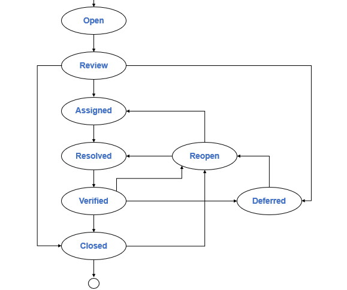

# [14] 테스트 실행 및 결함 보고

### 1. 테스트 실행

### 1-1. 테스트 절차 선정

### 1️⃣ 우선순위 전략

- **피처 집합** 우선순위 (우선순위 높은 피처 집합부터)
- **테스트 케이스** 우선순위 (테스트케이스는 이미 우선순위가 부여되어있음)
- **테스트 절차** 우선순위

### 2️⃣ 테스트 완료 기준 전략

테스트 **완료 기준 달성에 가장 큰 기여**할 수 있는 테스트 절차 먼저 실행

ex) ‘심각한 결함이 존재하지 않아야 한다’ → 심각한 결함과 관련된 테스트 절차 선택

### 1-2. 테스트 절차 실행

✏️테스트 실행 주체

| **테스트 레벨** | **개발자** | **테스터** | **사용자** |
| --- | --- | --- | --- |
| **컴포넌트 테스트** | O | O |  |
| **통합 테스트** | O | O |  |
| **시스템 테스트** | O | **O** | O |
| **인수 테스트** |  | O | O |

### 1-3. 테스트 결과 비교

### 1-4. 테스트 실행 기록

수행한 구체적인 작업과 목격된 이벤트들을 시간대별로 테스트 실행 로그 문서에 기록

---

### 2. 결함 보고

### 2-1. ✏️테스트 결과 분석

‘일고구’로 암기

### 1️⃣ 결함의 구체화

결함 원인 찾기 위해서 **결함 재연** → 관련 테스트 데이터, 테스트 절차, 테스트 환경이 명확히 파악되어야

예상치 못한 결함 발견하면 여러 회 동일한 테스트 실행 시도

### 2️⃣ 결함의 고립화

✏️결함의 발생에 *영향을 미치는 것*으로 추정되는 중요한 요소 바꿔가면서 수행

### 3️⃣ 결함의 일반화✏️

### 2-2. 결함 기록

- 결함 컨텍스트
- 결함 설명 (실제 결과 + 이상 상황)
- **심각도** (✏️*결함이 시스템에 미치는 정도*로 영향의 범위, 크기 + 임시로 적용할 우회 방법)
- 우선순위 (검출된 결함 해결의 긴급성 기술)
- 위험 분석
- 결함 상태

✏️  *테스트 결함 보고서에 결함 수정 방법은 기록 X*

✏️ *테스트 케이스가 상세할 수록 유지보수가 어렵고, 창의성을 떨어뜨리기도하고 살충제 효과에 걸리기 쉬움 (결함 효과적 발견과는 관련 X)*

### 2-3. 결함 추적

결함 생명 주기

### Open

테스터가 발견한 결함 ✏️*분석, 보고*된 상황

### Review

결함의 처리 방안 검토

이번에 수정되거나 (Assigned), 다음 릴리스에서 수정되거나 (Deferred), 무시 (Closed)될 수 있음

### Deferred

Open된 결함을 곧바로 수정x, 다음 릴리스에서 해결하기로 연기된 상태

- 적절한 시점에 Reopen되어 결함 처리가 시작될 수도 있음

### Assigned

결함을 수정할 개발자가 결정되고 결함 해결이 요구된 상태

### Resolved

개발자가 자신에게 할당된 **수정 해결을 처리**한 상태

- Fixed (개발자가 요청한 결함을 수정함)
- Duplicated (요청된 결함이 기존의 다른 결함과 중복됨)
- Won’t Fix (지금 수정할정도로 긴급하지않거나 수정안한경우)

### Verified

개발자의 결함 처리가 합당한지 **정확하게 검증이 된** 상태

- Fixed면 **재테스팅** 수행
- Duplicated면 동일한 이전 결함이 적절히 처리되었는지 검증
- Won’t Fix면 실제로 안중요하거나 안긴급한지 확인

| **Verified 이후의 상태** | **정확** | **부정확** |
| --- | --- | --- |
| **Fixed** | Closed | Reopen |
| **Duplicated** | Closed | Reopen |
| **Won’t Fix** | Deferred | Reopen |
| **Invalid** | Closed | Reopen |

### Closed

Fixed에 대해서 정확한 수정이 이루어졌다고 판단되면

### Reopen

결함이 정확하게 수정되지 않았다면

---

산출물 요약 (한눈에 보기 편함)

- 테스트 실행 로그
- 결함 보고서 *(✏️테스트 계획서→ 테스트케이스 명세서 → **테스트 결함 보고서** → 테스트 평가보고서 순)*
- 결함 추적 보고서 (Fixed가 제대로 되었는지 확인하기 위해 수행한 **재테스팅 결과** 기술)

### 결함 검출 비용 (Defect Detection Percentage)

적용한 테스트 기법이 얼마나 효과적이었는지 정량적으로 확인

$\text{결함 검출 비율} = \frac{\text{검출된 결함의 수}}{\text{존재하는 결함의 수}}= \frac{\text{테스터가 검출한 결함의 수}}{\text{테스터가 검출한 결함의 수}  +  \text{사용자가 발견한 결함의 수}}$

### 결함 구속효율성율 (Containment efficiency)

해당 단계에서 발견한 결함만을 고려

$\text{결함 구속효율성율} = \frac{\text{검출된 해당 단계의 결함 수}}{\text{해당단계에서 발생한 결함의 수}}$

*✏️ 전체 결함 중 수정한 비율*

Q. 검출한 120개 결함 중 100개를 수정하고, 수정하는 과정에서 새로 오류 40개를 발견했다. 이때에 전체 결함 중 수정한 비율은 ?
A. (전체 결함 중 수정한 비율) = (수정한 결함) / (실제 결함) = 100 / (120+40) = 62.5%